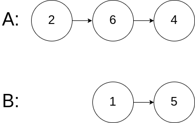

# 160.相交链表

**题目描述**

编写一个程序，找到两个单链表相交的起始节点。

如下面的两个链表：



在节点 c1 开始相交。

 

示例 1：


输入：intersectVal = 8, listA = [4,1,8,4,5], listB = [5,0,1,8,4,5], skipA = 2, skipB = 3

输出：Reference of the node with value = 8

输入解释：相交节点的值为 8 （注意，如果两个列表相交则不能为 0）。从各自的表头开始算起，链表 A 为 [4,1,8,4,5]，链表 B 为 [5,0,1,8,4,5]。在 A 中，相交节点前有 2 个节点；在 B 中，相交节点前有 3 个节点。

 

示例 2：


输入：intersectVal = 2, listA = [0,9,1,2,4], listB = [3,2,4], skipA = 3, skipB = 1

输出：Reference of the node with value = 2

输入解释：相交节点的值为 2 （注意，如果两个列表相交则不能为 0）。从各自的表头开始算起，链表 A 为 [0,9,1,2,4]，链表 B 为 [3,2,4]。在 A 中，相交节点前有 3 个节点；在 B 中，相交节点前有 1 个节点。

 

示例 3：


输入：intersectVal = 0, listA = [2,6,4], listB = [1,5], skipA = 3, skipB = 2

输出：null

输入解释：从各自的表头开始算起，链表 A 为 [2,6,4]，链表 B 为 [1,5]。由于这两个链表不相交，所以 intersectVal 必须为 0，而 skipA 和 skipB 可以是任意值。

解释：这两个链表不相交，因此返回 null。

 

注意：

如果两个链表没有交点，返回 null.

在返回结果后，两个链表仍须保持原有的结构。

可假定整个链表结构中没有循环。

程序尽量满足 O(n) 时间复杂度，且仅用 O(1) 内存。


## 方法：双指针法

两个链表的长度虽然不一定相同，但是两个链表的长度之和是固定的，而且后面有公共节点也就是说（链表1长度+链表2非公共节点长度==链表2长度+链表1非公共节点长度）

定义两个指针p1,p2,p1走完第一个链表后再从第二个链表开始走，同理p2走完第二个链表后再从第一个链表开始走，最终总会走到第一个相同的公共节点或者null。

```C++
class Solution {
public:
    ListNode* FindFirstCommonNode( ListNode *pHead1, ListNode *pHead2) {
        ListNode *p1 = pHead1;
        ListNode *p2 = pHead2;
        while(p1!=p2){
            p1 = (p1==NULL ? pHead2 : p1->next);
            p2 = (p2==NULL ? pHead1 : p2->next);
        }
        return p1;
    }
};
```

时间复杂度： O(n) 

空间复杂度： O(1)